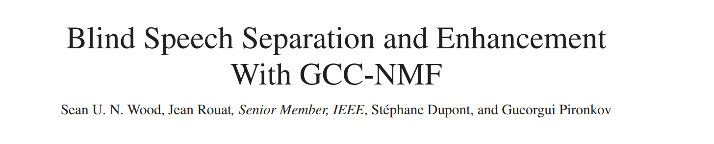

# BSS Blind Source Separation with GCC-NMF method

Original code: https://github.com/seanwood/gcc-nmf
Original paper: https://www.gel.usherbrooke.ca/rouat/publications/IEEE_ACMTrGCCNMFWoodRouat2017.pdf 

<p align="center">
  
</p>

## TODO  

* Hyper-parameter search

## Getting Started

## Requirements

```bash
pip install -r requirements.txt
```

Make sure you are using pytorch-nightly (version 1.0 alpha). This has the CTC_Loss loss function we need.

## Test

Create a `mix.wav` file at 8khz at the root of the repository and launch the script:

```bash
python bss/bss.py
```

This will separate the mixed audio file into two separated audio files. 

## Contributions

For any question please contact me at j.cadic@protonmail.ch
